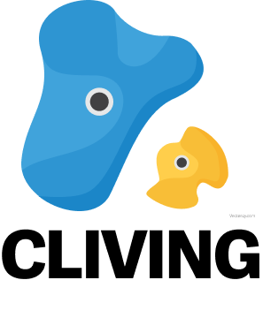

<div align=center>
    
</div>

# CLIVING FRONT
*Climbing Clip Archive Service* **CLIVING**의 Front-End 레포지토리입니다.

## 요구사항
- Flutter 3.22.2
- Dart 3.4.3
- iOS Deployment Target 12.0 (iOS 개발 시)

## 스택
<div align=center>
    
    
    
    
    
    
</div>
<div align=center>
    
    
    
    
</div>

## 설치 및 실행 방법
### 1. Git Clone
~~~ bash
git clone https://github.com/KOBOT-13/cliving-front.git
cd cliving-front
~~~
### 2. Flutter package install
    flutter pub get
### 3. Create .env
~~~ bash
vi .env
API_ADDRESS=http://{SERVER_IP_ADDRESS}
:wq
~~~
-  SERVER_IP_ADDRESS
    + IOS LOCAL IP : 127.0.0.1:8000
    + ADNROID LOCAL IP : 10.0.2.2:8000
    
### 4. Emulator Launch and Flutter run
- 에뮬레이터 확인
``` bash
flutter emulator
```
- 에뮬레이터 실행
~~~
flutter emulators --launch <emulator id>
~~~
- Flutter 실행
~~~
flutter run
~~~

## 프로젝트 구조
```
📦cliving-front
┣📦assets
┃ ┣ 📂fonts
┃ ┗ 📂images
┃   ┗ 📜entry.png
┣📦lib
┃ ┣ 📂charts
┃ ┃ ┣ 📜line_chart.dart
┃ ┃ ┗ 📜pie_chart.dart
┃ ┣ 📂models
┃ ┃ ┣ 📜Frame.dart
┃ ┃ ┣ 📜Hold.dart
┃ ┃ ┣ 📜TestHold.dart
┃ ┃ ┗ 📜page.dart
┃ ┣ 📂screens
┃ ┃ ┣ 📜analytics_screen.dart
┃ ┃ ┣ 📜calendar_screen.dart
┃ ┃ ┣ 📜camera_screen.dart
┃ ┃ ┣ 📜entry_screen.dart
┃ ┃ ┣ 📜event.dart
┃ ┃ ┣ 📜main_screen.dart
┃ ┃ ┣ 📜record_screen.dart
┃ ┃ ┣ 📜setting_screen.dart
┃ ┃ ┗ 📜video_player_screen.dart
┃ ┗ 📜main.dart
┣ 📜.env
┣ 📜.gitignore
┗ 📜pubspec.yaml
```
- assets : 폰트, 앱 로고 이미지 파일 등 애플리케이션에 포함될 정적 리소스를 저장하는 데 사용
- lib

    * charts : 차트 관련 코드를 저장하는 디렉토리
    * models : 데이터 모델을 정의하는 파일을 저장하는 디렉토리
    * screens : 앱의 각 화면을 정의하는 파일을 저장하는 디렉토리
    * main.dart : 애플리케이션의 진입점이 되는 파일. 앱의 루트 위젯을 정의
- root
    
    * .env : 환경 변수 파일로, 앱에서 사용할 환경 변수들을 정의
    * .gitignore : Git에서 추적하지 않을 파일아니 디렉토리들을 정의
    * pubspec.yaml : Flutter 프로젝트의 설정 파일로, 프로젝트의 종속성, 에셋, 패키지 등을 정의

## Front-End
<div align=center>

|||
|:-:|:-:|
|HYEJIN LIM<br/>[@ima9ine4](https://github.com/ima9ine4)|이재영<br/>[@rktlskan021](https://github.com/rktlskan021)|
</div>